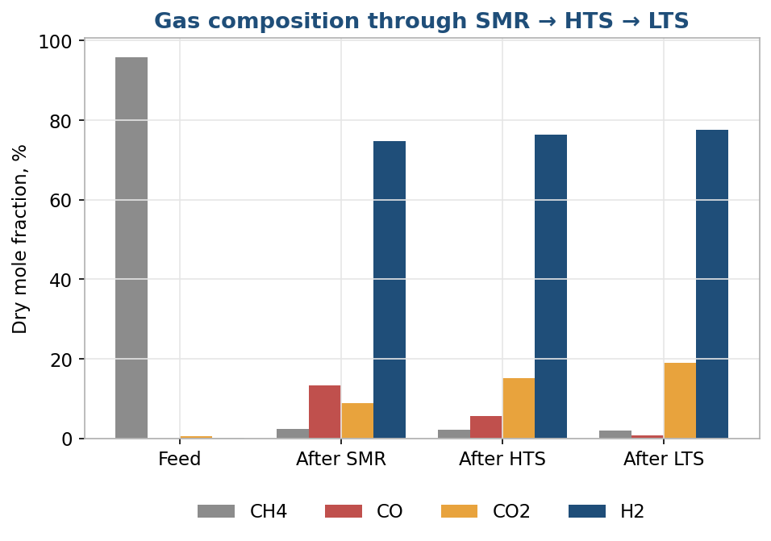
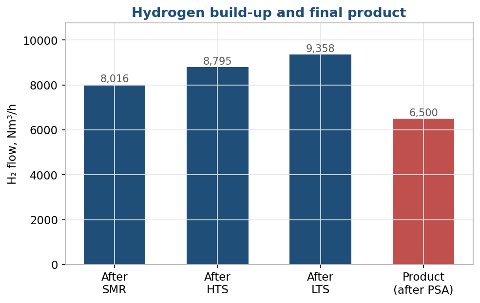
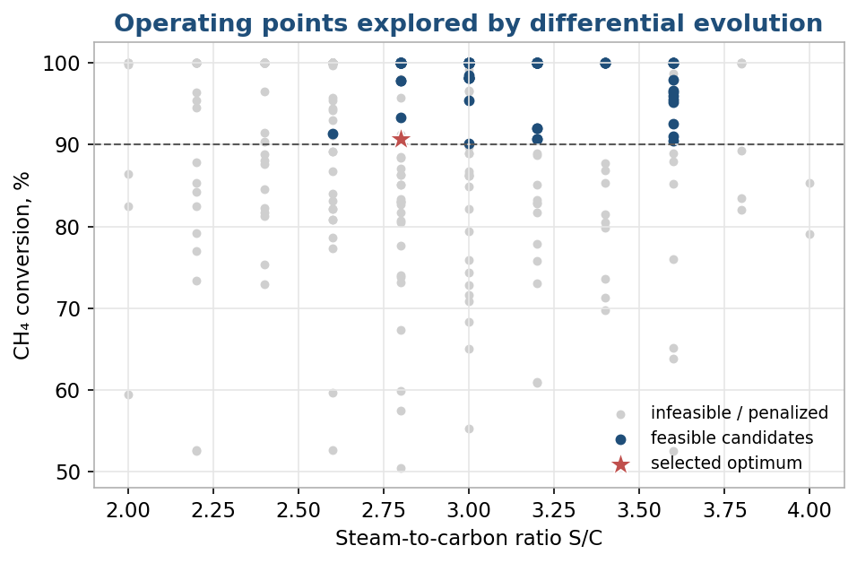
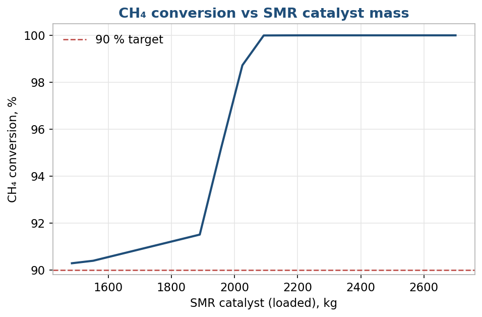

# Hydrogen Production from Natural Gas — SMR → HTS → LTS Process Model

A from-scratch **Python** model of an industrial hydrogen plant: steam methane reforming
(SMR) followed by high- and low-temperature CO shift (HTS, LTS), gas–liquid separation
and a pressure-swing adsorption (PSA) balance. The model sizes the catalyst beds and
reactor geometry, then uses **differential-evolution optimization** to find the operating
point that hits the production target with the lowest steam and heat load.

> **Result:** the optimized design converts **90.7 %** of the methane feed and delivers
> **6 500 Nm³/h of product hydrogen at 99.97 mol % purity**, with a full material, heat and
> hydraulic balance that closes to machine precision.

**Built with:** Python · NumPy · SciPy (`differential_evolution`) · pandas · Matplotlib
**Context:** bachelor's thesis, *Chemical Technology* (Gubkin University), pure-Python model — no commercial process simulator used.

---

## The process

Natural gas (2 600 Nm³/h CH₄) is mixed with steam and passed through three catalytic reactors,
then cooled, dried and purified:

```
Natural gas ─► SMR ─► HTS ─► LTS ─► cooler ─► separator ─► PSA ─► H₂ product (6 500 Nm³/h)
             (reforming) (shift) (shift)      (water out)        (tail gas → fuel)
```

As the gas moves through the chain, methane is reformed to hydrogen and CO is progressively
shifted to CO₂ — visible in the dry composition at each stage:



## Key results

Optimized operating point: **SMR 860 → 740 °C, HTS in 385 °C, LTS in 190 °C, S/C = 2.8, P = 19 bar.**

| Metric | Value |
|---|---|
| CH₄ conversion | 90.7 % |
| Dry CO after LTS | 0.64 % |
| H₂ in reactor gas | 9 358 Nm³/h (H₂/CH₄ = 3.60) |
| **H₂ product after PSA** | **6 500 Nm³/h @ 99.97 mol %** |
| PSA hydrogen recovery | 69.5 % |
| PSA tail gas (fuel) | 5 710 Nm³/h, LHV ≈ 11.2 MW |
| SMR reactor heat duty | 5.4 MW |
| Steam generation duty | 5.0 MW |
| Total cooling duty | 6.2 MW |
| SMR reactor | 39 active tubes, bed ≈ 4.85 m |



*Note on the target:* at 2 600 Nm³/h CH₄ with ≥ 90 % conversion, the reactor block naturally
produces more than 6 500 Nm³/h of hydrogen. The **6 500 Nm³/h is therefore the product target
after PSA purification**, and the reactor block is sized with margin above it.

## How the model works

The engine (`core_reactor_block.py`) integrates the reactors layer by layer and closes every balance:

- **Reaction kinetics** — two selectable SMR kinetic models: **Xu–Froment (1989)** and
  **Hou–Hughes (2001)** (default). HTS and LTS are modelled as adiabatic water-gas-shift beds.
- **Effectiveness factor** `eta_eff` applied per catalyst to account for intra-pellet diffusion,
  and a **reserve factor** `K_res` for the installed (loaded) catalyst mass.
- **Pressure drop** from the **Ergun equation**, with automatic sizing of the number of active
  SMR tubes and of the HTS/LTS vessel diameters from the superficial gas velocity.
- **Material, heat and atomic balances** across the whole train (reforming duty, steam raising,
  feed preheat, interstage cooling, condensation).

The design runs as a four-step pipeline:

| Step | Script | What it does |
|---|---|---|
| 01 | `01_catalyst_hydraulics_selection.py` | Hydraulic sizing, active SMR tubes, catalyst masses, fixed pressure drops |
| 02 | `02_operating_optimization.py` | Differential-evolution search over T, P and S/C |
| 03 | `03_final_balances.py` | Final material / heat / hydraulic balances at the optimum |
| 04 | `04_separator_psa_simple.py` | Cooling, water knockout, PSA balance, product & tail gas |

**Optimization.** Six variables (SMR inlet temperature and temperature drop, HTS and LTS inlet
temperatures, steam-to-carbon ratio, inlet pressure) are searched with
`scipy.optimize.differential_evolution`. Hard process limits (≥ 90 % conversion, ≤ 1 % dry CO,
product pressure ≥ 16 bar, valid temperature windows) enter as dominant penalties; heat load and
steam use rank the feasible points. The optimizer converges on the lowest-steam feasible design:



Catalyst mass is chosen from a sweep showing where conversion reaches the target and then plateaus —
avoiding oversizing:



## Validation

The closed atomic balance is a built-in correctness check — carbon, hydrogen, oxygen and nitrogen
in equal out to a relative error of **~10⁻¹⁴** (machine precision), confirming the material balance
is internally consistent.

## Repository structure

```
.
├── core_reactor_block.py                 # model engine: kinetics, Ergun, balances
├── 01_catalyst_hydraulics_selection.py   # step 01 — sizing
├── 02_operating_optimization.py          # step 02 — optimization
├── 03_final_balances.py                  # step 03 — final balances
├── 04_separator_psa_simple.py            # step 04 — separator + PSA
├── run_all.py                            # runs steps 01→03 in sequence
├── make_figures.py                       # builds the figures below from results
├── figures/                              # result figures (shown above)
├── results/                              # generated CSV tables (created on run)
└── requirements.txt
```

## How to run

```bash
pip install -r requirements.txt
python run_all.py                    # steps 01, 02, 03  → results/*.csv
python 04_separator_psa_simple.py    # step 04           → results/04*.csv
python make_figures.py               # figures/*.png
```

All tables are written to `results/` as UTF-8 CSV (opens cleanly in Excel).
Key design inputs live at the top of `core_reactor_block.py` (feed rate, target, catalysts, geometry, optimization ranges).

## Skills demonstrated

- Numerical modelling and constrained optimization in Python (SciPy `differential_evolution`, root-finding, layer-by-layer integration)
- Chemical reactor kinetics, water-gas-shift equilibrium, Ergun hydraulics
- Full process material / heat / atomic balances and reactor sizing
- Data processing with pandas and clear result visualization with Matplotlib
- Reproducible, modular pipeline design (separated engine, steps and post-processing)

## Author

**Sofia Kachaburova** — kachaburovasi@mail.ru
Bachelor of Chemical Technology, Gubkin Russian State University of Oil and Gas.
